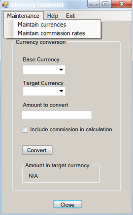
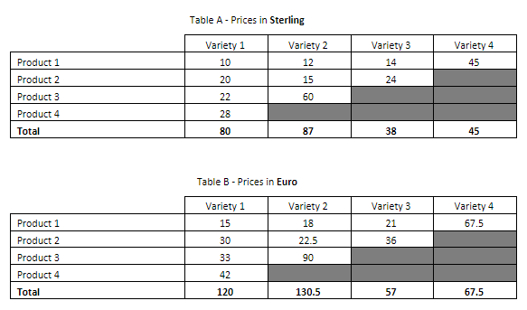

# SDET Technical Test

## Purpose and Instructions

### Purpose

As it is difficult to fully assess somebody’s abilities at an interview, we ask all potential recruits to undertake a small technical exercise in their own time. The problem is a fairly simple one, which should be completed in the applicant’s own time.

This is a very important part of our hiring process. Therefore we recommend that candidates give this adequate consideration and address this task as they would do for any other professional assignments in their current workplace (particularly with respect to the software development exercise in Part 2).

### Instructions 

-   With respect to the first part of this test, please submit your answers in the format of a Word Document added to this repository
-   With respect to the second part of this test, the software can be written in a suitable programming/scripting language of the candidate’s choice. C# is preferred but another high-level language such as Java is for instance possible.
-   We use GitHub to host these tests to create a modern practical engineering experience. Please complete this exercise and create a pull request containing your solution 
-   We recommend you create a development branch for your development and from this create a final pull request to the master branch for review
-   We would much prefer that you submit a complete software implementation that demonstrates modern engineering best practices.  However we also appreciate that to provide a complete solution we may be expecting too much of the candidates time. If you are pressed for time, we recommend you use the pull request to comment on areas that, given more time, you would address or have done differently. 
-   Please update the RUNME.MD file with instructions how to run your application 

**Please note that your submission must only contain your own work. Under no circumstances should your submission contain any content owned or created (in whole or in part) by a third party except where you are expressly permitted to do so by the relevant third party. You may, for instance, use an open-source library for ancillary tasks, though you should not use one for the primary algorithms. Use of AI is allowed, under the condition that you understand and disclose where and how it was used.**

## Exercise

### Part 1
The following is the main form of an application that converts values from one currency to another. The collection of currencies, exchange rates, and rules for applying commission are held in a shared database, accessed by multiple users of this application on a network. The user of this form selects a base currency, a target currency, specifies an amount (expressed in the base currency), can choose to include or exclude commission, then hits the Convert button to generate the equivalent value in the target currency. That value is shown where “N/A” is displayed in the screenshot below.

The separate “Maintain currencies” form (not shown) provides operations for adding, deleting and editing currencies. A separate process constantly updates the database with exchange rates for any recognised currencies (you do not need to worry about how this works, but you do have control over stopping and starting it).

The separate “Maintain commission rates” form (not shown) provides operations for specifying a minimum commission value and a collection of commission rates for different ranges of values. The minimum commission value and ranges are defined in Sterling. For example, for “amount to convert” values in the range 0.01 to 100.00 pounds Sterling, the commission rate is 5%. An example minimum commission value is £10.

In the following questions, identifying tests is adequate, details of test data and expected results are not required where they can be inferred. Aim for an answer no longer than 1200 words for this entire section:

1. Using the database and the GUI, how would you test the functionality of this form? 
2. What tests would you perform to test the operations supported by the “Maintain currencies” form?
3. What tests would you perform to test the operations supported by the “Maintain commission rates” form?
4. What tests would you perform on the form above in order to test accessibility?
5. If you were automating the testing of this form for regression test purposes, what would you hope the developer had done that would make the automation easier?
6. If this application were used internationally, what further tests would you perform?
7. Looking at the screenshot of the form above, what user interface issues are immediately apparent (you may have mentioned some of these in previous answers)?

### Part 2

Table A below represents an example of a pricing table containing a number of products and their varieties. The prices of these products are in pounds sterling. 

Table B represents the same products and varieties with their prices converted to Euros. The value in each cell of Table B is calculated from the value in the corresponding cell in Table A.
In other words: Value (Product1, Variety1) in “Table B” = (Value (Product1, Variety1) in “Table A”) * conversion rate. In the example below, the conversion rate is 1.5.

The shaded cells should not contain values.  

The value in each cell in the bottom row is equal to the sum of the values in the corresponding column.

**Exercise:** write a test to check the correctness of Table B in relation to Table A. Consideration should be given to the variety of possible errors conditions within other real-world data, and how these can be tested. We are not concerned solely with whether or not the test works, but also with how tidy, structured and robust it is.

## Copyright
© 2025 WTW. All rights reserved. Proprietary and Confidential. For WTW employees and candidates only.
